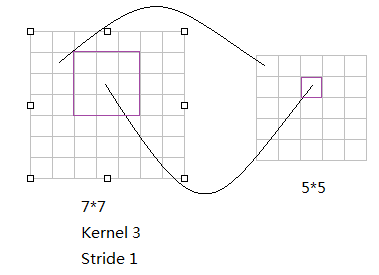
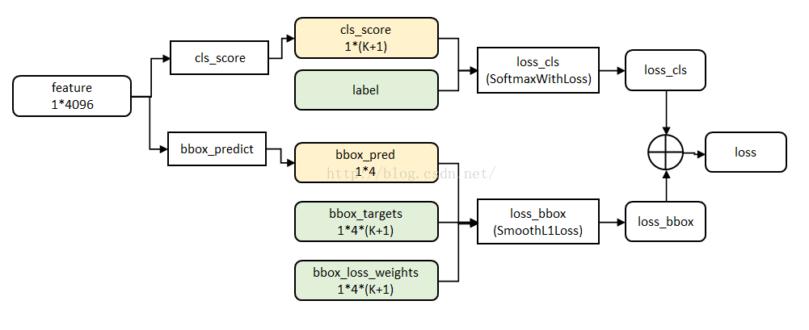

# Fast-RCNN

FastRCNN作为RCNN的改进版本，极大的加快了识别速度，其原理如下

## 流程

(1)输入测试图像；

(2)利用selective search 算法在图像中从上到下提取2000个左右的建议窗口(Region Proposal)；

(3)将整张图片输入CNN，进行特征提取；

(4)把建议窗口映射到CNN的最后一层卷积feature map上；

(5)通过RoI pooling层使每个建议窗口生成固定尺寸的feature map；

(6)利用Softmax Loss(探测分类概率) 和Smooth L1 Loss(探测边框回归)对分类概率和边框回归(Bounding box regression)联合训练.

## （1）Selective search 

略

## （2）CNN 提取特征

略

## （3）将建议的窗口映射到最后一层卷积的特征图上

从原图候选框到最后一张特征图的映射

## （4）通过RoI pooling层使每个建议窗口生成固定尺寸的feature map

由于region proposal的尺度各不相同，而期望提取出来的特征向量维度相同，因此需要某种特殊的技术来做保证。ROIPooling的提出便是为了解决这一问题的。其思路如下：

- 将region proposal划分为H×W大小的网格
- 对每一个网格做MaxPooling（即每一个网格对应一个输出值）
- 将所有输出值组合起来便形成固定大小为H×W的feature map

## （5）分类和回归

利用Softmax Loss(探测分类概率) 和Smooth L1 Loss(探测边框回归)对分类概率和边框回归(Bounding box regression)联合训练.多任务损失函数如下

