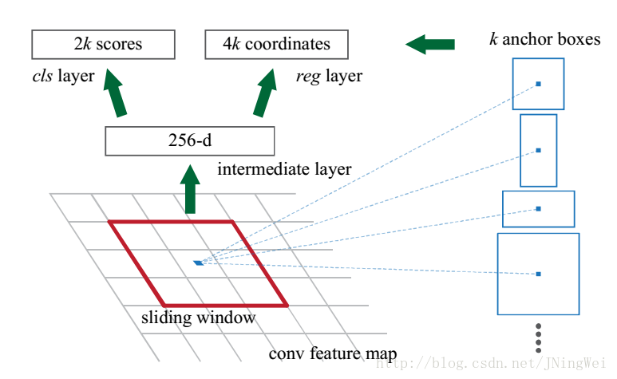

# Faster-RCNN

faster rcnn 在fastrcnn的基础上叕做了优化，速度、准确率均有提升

## 整体流程

1) Conv layers提取特征图

2) RPN(Region Proposal Networks)

3) RoI Pooling

4) 分类和回归

## （1） Conv layers提取特征图

略

## （2） RPN(Region Proposal Networks)

替换了selective search，使用RPN网络用于生成region proposals

首先生成一堆Anchor box，对其进行裁剪过滤后通过softmax判断anchors属于前景(foreground)或者后景(background)，即是物体or不是物体，所以这是一个二分类

整个RPN分成3步，1.生成anchor 2.对anchor分类、回归，3. 过滤无用anchor

### anchor

所谓anchor，其实就是候选框，也就是selective search的那些区域，但是在成为感兴趣区之前，有很多没有用的框框，这些有用的和没用的框框都叫anchor

### 生成anchor

有人说rpn其实是“ 基于滑窗的无类别obejct检测器”,9种anchors在原图上的示意图如图所示（每种anchor只显示了1个）

在最后一张特征图上的每一个点，其实在原图中都是一块很大的区域（上图中的大区域），在这个区域内可能有目标，为了能更能逼近目标，我们需要3种尺度，和3种形状。3X3=9，就是图中的那9种物体框。假设原图中有一个物体，那我们通过在原图上平移黑框，就总能找到一个颜色框能正好把物体框在里面，而且尺度啊形状最接近。

那么如何平移的呢？在原图上你一个像素一个像素平移没意义啊，难道要重复提取特征？所以平移必须在特征图上平移，因为特征图最后总能映射回原图。11X11的特征图区域，在原图中就表示1111个大黑框，每个大黑框里面又有9个小颜色框，这样就会产生11X11X9个不同位置，不同尺度，不同形状的物体框，基本足够框出所有物体了。

下图为论文配图

### 对anchor分类、回归

计算anchor内是否有物体的概率，以及回归预测框的4个坐标

### 过滤无用anchor

实现对anchor的 **初步筛除**（先剔除越界的anchor，再根据cls结果通过NMS（下面讲）算法去重）和 **初步偏移**（根据bbox reg结果）

#### NMS

对于Bounding Box的列表B及其对应的置信度S,采用下面的计算方式.选择具有最大score的检测框M,将其从B集合中移除并加入到最终的检测结果D中.通常将B中剩余检测框中与M的IoU大于阈值Nt的框从B中移除.重复这个过程,直到B为空.

## （3）RoI Pooling

上边这些全都做完了之后,留下的anchor 叫做proposal,proposal 成为 RoI (感兴趣区域) ，被输入 RoIPooling  中进行 size上的归一化。

## （4） 分类和回归

与fast-rcnn相同, 同时，回归任务又在头部这里进行了一次，显然是不太放心RPN
