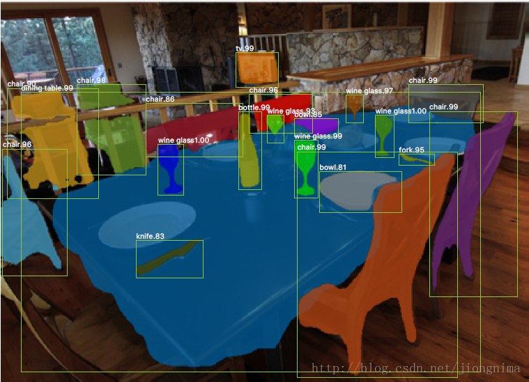
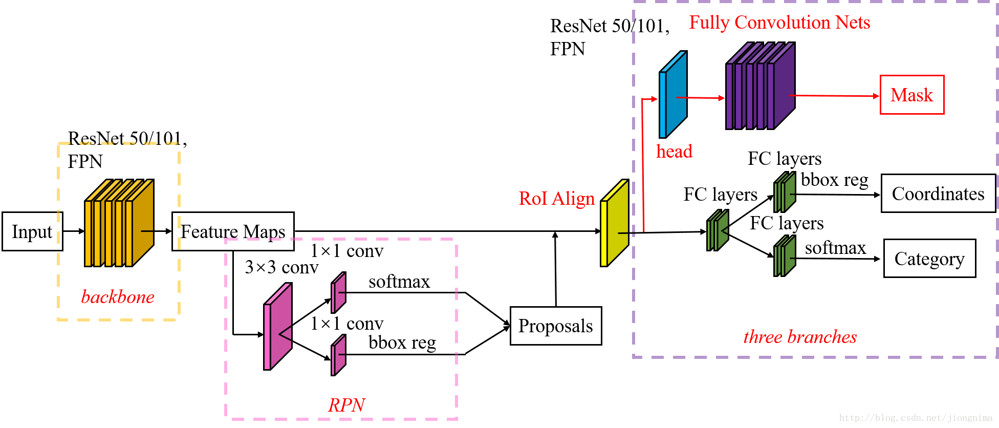

# Mask-RCNN

Mask-RCNN 取得了极大的成功并广泛应用于各种识别项目中，先上效果图

Mask-RCNN主要解决了3个问题

1) 目标检测，直接在结果图上绘制了目标框(bounding box)。

2) 目标分类，对于每一个目标，需要找到对应的类别(class)，区分到底是人，是车，还是其他类别。

3) 像素级目标分割，在每个目标中，需要在像素层面区分，什么是前景，什么是背景。

在Faster-RCNN上的变动：

1.加了一个Mask Prediction Branch (Mask 预测分支)，使模型能够进行像素级目标分割

2.将ROI Pooling 改为ROI Align

## ROI Align

在得到特征图后，如何得到一个6×6的全连接层的输入呢？RoI Pooling这样做：将RoI对应的特征图分成6×6块，然后直接从每块中找到最大值。在将特征图分块的时候，又用到了取整。

这种取整操作(在Mask R-CNN中被称为quantization)对RoI分类影响不大，可是对逐像素（Mask）级别的预测目标是有害的，因为对每个RoI取得的特征并没有与RoI对齐。因此，Mask R-CNN对RoI Pooling做了改进并提出了RoI Align。

ROI 通过双线性插值将ROI 变成方阵，在pooling，就可以避免分块操作时的取整misalignment.使得为每个RoI取得的特征能够更好地对齐原图上的RoI区域

## Mask

faster-rcnn 的loss由两部分组成，分类+box回归，

mask的loss 添加了mask回归，由Lcls+Lbox+Lmask组成

其中Lcls和Lbox和Fast RCNN中定义的分类和回归损失一致，详细介绍下Lmask。在Mask R-CNN中，对于新增加的mask支路，其对于每个ROI的输出维度是（K,m,m)，其中mm表示mask的大小，K表示K个类别，因此这里一共生成K个binary mask。这就是文章中提到的class-specific mask概念（原来Faster RCNN的检测部分对坐标的回归也是区分类别的），相对应的就有class-agnostic mask，表示每个ROI输出一个mm的mask，这个mask不存在类别的概念，作者也做了实验证明这两种设计对最后的结果差别不大，因此默认采用class-specific mask。在得到预测mask后，对mask的每个像素点值求sigmoid函数值，得到的结果作为Lmask（交叉熵损失函数）的输入之一。需要注意的是这里也只有正样本ROI才会用于计算Lmask，正样本的定义和目标检测一样，都是IOU大于0.5定义为正样本。其实Lmask和Lcls非常类似，只不过前者是基于像素点来计算，后者是基于图像来计算，因此和Lcls类似，虽然这里得到K个mask，但是在计算cross-entropy损失函数时只有ground truth对应的那个mask才有效。

## 双线性插值

假设源图像大小为mxn，目标图像为axb。那么两幅图像的边长比分别为：m/a和n/b。注意，通常这个比例不是整数，编程存储的时候要用浮点型。目标图像的第（i,j）个像素点（i行j列）可以通过边长比对应回源图像。其对应坐标为（i*m/a,j*n/b）。显然，这个对应坐标一般来说不是整数，而非整数的坐标是无法在图像这种离散数据上使用的。双线性插值通过寻找距离这个对应坐标最近的四个像素点，来计算该点的值。

## 附

[大佬们实现的Mask-RCNN](https://github.com/matterport/Mask_RCNN),非常好用