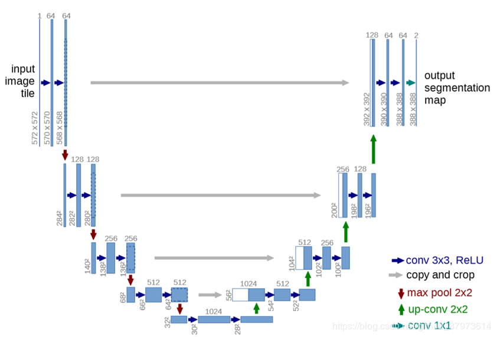
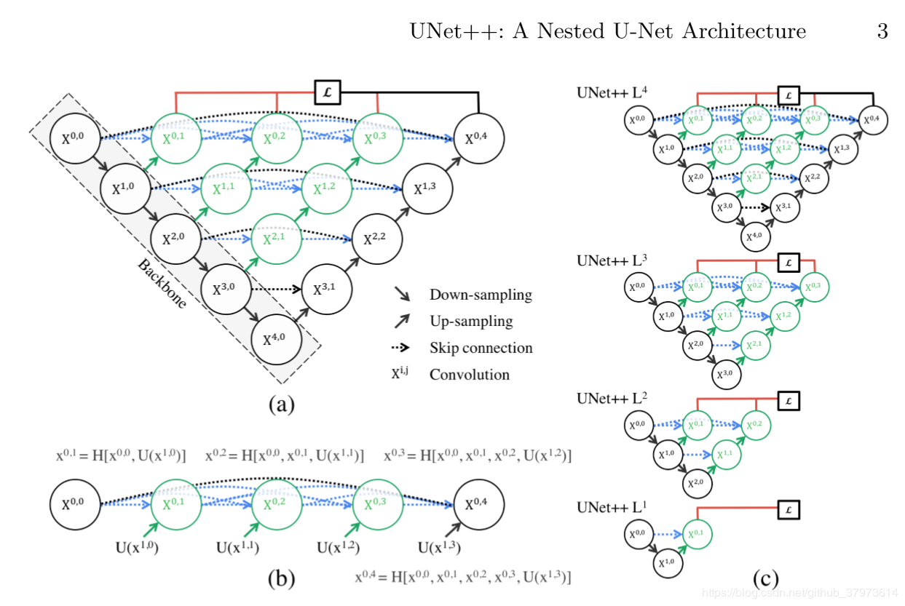

# Unet

Unet 在医学图像分割取得了很好的结果

生物医学图像相较于自然图像来说，本身分割难度大，体现在生物图像中分割目标边界模糊、变形一类的复杂情况。	

## 模型结构

整体结构就是先编码（下采样）， 再解码（上采样），回归到跟原始图像一样大小的像素点的分类，由于在卷积过程中将图像->高语义feature map的过程看成编码器，高语义->像素级别的分类score map的过程看作解码器，并通过Skip connection在层与层之间传递信息，能够很好的分割实例。

## 下采样

下采样是通过max pool 2x2来进行1/2下采样的，下采样之间是两个conv卷积层，这里的卷积是使用valid卷积。所以在卷积过程中图像的大小是会减小的。

这会造成一个问题，就是在skip connection部分concat时候大小不一致，因为在上面有一个copy & crop操作，crop就是为了将大小进行裁剪的操作。

## 上采样

上采样，相对于FCN的转置卷积进行上采样，这里是一个up-conv 2x2，具体对应的操作是：对每行每列进行2倍翻倍。

# Unet++

其实是对Unet U型结构中空的地方进行了填补

有一个问题就是，unet 到底要多深，或者多浅，才能适合你的模型？答案并不是绝对的越深越好或者越浅越好，这样的话如何同时使用浅层和深层的特征

既然  ，  ，  ，  所抓取的特征都很重要，为什么要降到  层了才开始上采样回去呢？

引自[大佬](https://zhuanlan.zhihu.com/p/44958351)：

> 我们来看一看，这样是不是把1～4层的U-Net全给连一起了。我们来看它们的子集，包含1层U-Net，2层U-Net，以此类推。这个结构的好处就是我不管你哪个深度的特征有效，我干脆都给你用上，让网络自己去学习不同深度的特征的重要性。第二个好处是它共享了一个特征提取器，也就是你不需要训练一堆U-Net，而是只训练一个encoder，它的不同层次的特征由不同的decoder路径来还原。这个encoder依旧可以灵活的用各种不同的backbone来代替

大佬说：

1.unet++不仅包含了unet中的长连接，还加入了新的短链接

2.unet++整合了不同深度的unets

3.在x0.1,x0.2,x0.3处放置的强监督（一层1X1卷积，叠加输出到loss），能够达到剪枝的效果。即更好的融合深度不同的unet

#### [专门挂一下大佬连接](https://zhuanlan.zhihu.com/p/44958351)