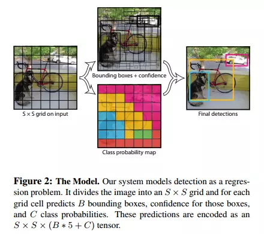

# YOLO

You Only Look Once（直接看文末PPT肯定能看懂）

模型结构

系统将输入的图片划分为S X S个小格子，如果物体的中心( **这里说的物体的中点应该是指ground truth box中的物体的中心** )落入到某一个小格中，则对应的小格负责检测这个物体。

每个小格子预测B个`bounding boxes`以及对应的置信度(`confidence scores`),这些置信度反映了box包含物体的信心以及准确度。我们定义置信度为Pr(Object) ∗ IOUtruthpred.如果box中不存在物体，那么`confidence scores`为`0`（*即意味着Pr(Object) =0*），否则，我们希望预测的置信值和ground truth的 IOU相同（*即意味着Pr(Object) =1*）。

每个`bounding box`由五个预测值组成:`x,y,w,h`和`confidence`。`(x,y)`坐标表示相对于网格单元边界的框的中心。`(w,h)`为与全图信息相关的box的宽和高。`confidence`代表了`predicted box`和任何 `ground truth box`的IOU。

每个网格单元还预测 C个（文中是20个）条件类概率Pr(Classi|Object)，这些概率适用于包含对象的网格单元格，概率值C代表了格子包含一个目标的概率，每个小格子只预测一组类概率，而不考虑框B的数量。在测试时，每个box通过类别概率和box置信度相乘来得到特定类别置信度(得到的是列向量)

一个列向量表示的是该box存在所有可能物体的概率，对所有的列进行NMS，可得到最符合物体的box

## LOSS函数

# 强推

[有关YOLO的幻灯片](https://docs.google.com/presentation/d/1aeRvtKG21KHdD5lg6Hgyhx5rPq_ZOsGjG5rJ1HP7BbA/pub?start=false&slide=id.p)（顺道还讲了NMS)

